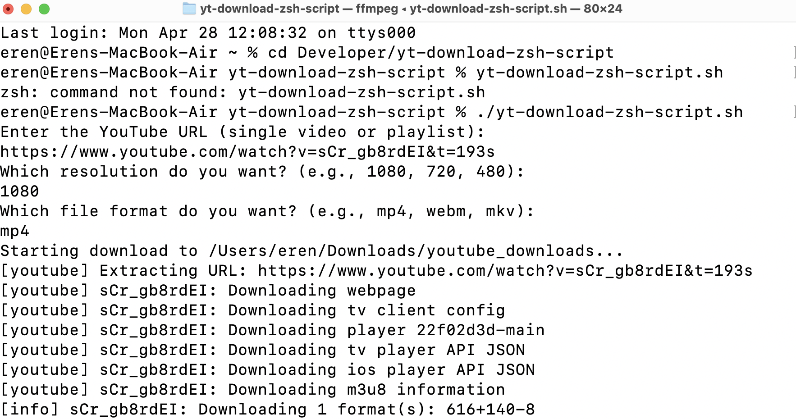

# 📥 YouTube Download and QuickTime Converter (ZSH Script)



This is a simple **Zsh script** that allows you to:

- Download **YouTube videos or playlists** 🎬
- Select your **desired resolution** (1080p, 720p, 480p)
- Choose **output format** (mp4, webm, mkv)
- Automatically **convert** downloaded videos to be **QuickTime Player compatible** 🍏

Everything happens in a few simple steps — no manual fixing needed!

---

## 🚀 Features

- ✅ Supports single videos and playlists
- ✅ Progress bar during download
- ✅ Automatic format and resolution selection
- ✅ Automatic conversion to `.mp4` (QuickTime-friendly)
- ✅ Saves downloads neatly into `~/Downloads/youtube_downloads`

---

## 🛠 Requirements

- [yt-dlp](https://github.com/yt-dlp/yt-dlp)
- [ffmpeg](https://ffmpeg.org/)
- macOS Terminal (Zsh shell)

You can install dependencies via Homebrew:

```bash
brew install yt-dlp ffmpeg
```

---

## 📋 Usage

1. Clone this repository:

```bash
git clone https://github.com/yourusername/youtube-downloader-script.git
cd youtube-downloader-script
```

2. Make the script executable:

```bash
chmod +x youtube-super-download.sh
```

3. Run the script:

```bash
./youtube-super-download.sh
```

4. Follow the prompts:
   - Enter YouTube link (single video or playlist)
   - Choose resolution (e.g., 1080, 720, 480)
   - Choose file format (e.g., mp4, webm, mkv)

5. The script will:
   - Download the video(s)
   - Convert them to a QuickTime-friendly `.mp4`
   - Save them in your `~/Downloads/youtube_downloads` folder

---

## 📸 Example

```bash
$ ./youtube-super-download.sh

Enter the YouTube URL (single video or playlist):
> https://www.youtube.com/playlist?list=PLabcd1234

Which resolution do you want? (e.g., 1080, 720, 480):
> 1080

Which file format do you want? (e.g., mp4, webm, mkv):
> mp4

[Download progress...]
[Converting videos...]
[Done! Files saved in ~/Downloads/youtube_downloads]
```

---

## ⚡ Tips

- If QuickTime still cannot open a downloaded file, the script's auto-conversion will fix it.
- VLC Player is recommended for playing any format directly without conversion.

---

## 📜 License

This project is licensed under the [MIT License](LICENSE).

# 🎯 Final Note
This is a quick, powerful tool to handle YouTube downloads and conversions completely from your macOS Terminal.  
**Enjoy downloading!** 🚀🎬