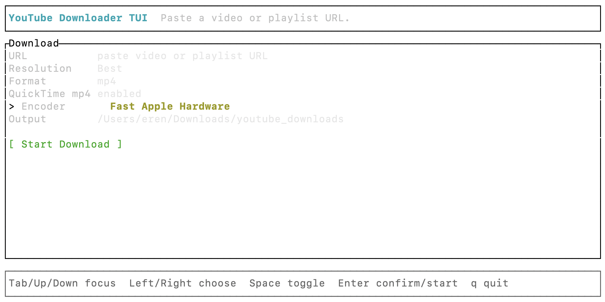

# YouTube Downloader TUI for macOS



A macOS-first Ratatui terminal UI for downloading YouTube videos or playlists with `yt-dlp`, with optional QuickTime-friendly `.mp4` conversion through `ffmpeg`.

The goal is a simple Terminal.app workflow: paste a URL, choose quality, download, and get files that open cleanly in QuickTime Player and Finder.

---

## Quick Start

Install with one command on macOS:

```bash
brew install rust yt-dlp ffmpeg && cargo install --git https://github.com/erenertemden/yt-download-zsh-script
```

Then run:

```bash
yt-download-tui
```

For local development, clone and run from source:

```bash
git clone https://github.com/erenertemden/yt-download-zsh-script.git
cd yt-download-zsh-script
cargo run
```

Downloads are saved to:

```text
~/Downloads/youtube_downloads
```

---

## Current Status

This is currently a Rust app that can be installed from Git with `cargo install --git`. A source-based Homebrew formula is included for `--HEAD` installs, but there is not yet a public tap, GitHub release binary, or crates.io package.

Current MVP features:

- URL input
- Available source format loading from `yt-dlp`
- Fallback resolution selection
- Output container selection
- Editable output directory
- QuickTime conversion toggle
- Encoder selection for fast Apple hardware encoding or smaller CPU x264 output
- Live `yt-dlp` / `ffmpeg` logs
- Structured playlist queue progress during downloads
- Download and conversion progress when the tools report timing output
- Cancel support for the active `yt-dlp` or `ffmpeg` process
- Result screen with new-download and open-folder actions

---

## Requirements

- Rust toolchain: `cargo`, `rustc`
- [yt-dlp](https://github.com/yt-dlp/yt-dlp)
- [ffmpeg](https://ffmpeg.org/) including `ffprobe`
- macOS Terminal, iTerm2, or another compatible terminal emulator

Verify installed commands:

```bash
cargo --version
yt-dlp --version
ffmpeg -version
ffprobe -version
```

---

## Usage

Start the app:

```bash
cargo run
```

The TUI fields:

- `URL`: YouTube video or playlist URL
- `Source Format`: `Auto best` or a format loaded from the current URL
- `Fallback Res`: `Best`, `1080`, `720`, or `480`; used only when `Source Format` is `Auto best`
- `Container`: `mp4`, `webm`, or `mkv`
- `QuickTime mp4`: creates macOS-friendly `fixed-*.mp4` files after download
- `Encoder`: `Fast Apple Hardware` or `Smaller CPU x264`
- `Output`: editable output directory; `~/...` paths are expanded on start

Controls:

- `Tab`, `Up`, `Down`: move between fields
- `f`: load available formats for the current URL
- `Left`, `Right`: change source format, fallback resolution, container, or encoder mode
- `Space`: toggle QuickTime conversion
- `Enter`: confirm/start, or start a new download on the result screen
- `o`: open output folder on the result screen
- `Esc`: quit when idle
- `q`: quit when idle and not editing `URL` or `Output`
- `q`, `Esc`, `Ctrl-C`: cancel the active process while a download or conversion is running

Basic flow:

1. Paste a YouTube video or playlist URL.
2. Leave `Source Format` on `Auto best` for the simplest path, or press `f` to load exact formats for the URL.
3. If using `Auto best`, choose `Fallback Res`.
4. Choose output `Container`.
5. Edit `Output` if the default folder is not right.
6. Enable or disable `QuickTime mp4`.
7. Choose encoder mode if QuickTime conversion is enabled.
8. Start the download and watch progress, queue, and logs.
9. Review the result screen.

---

## Format Selection

`Source Format` controls how precise the download format is:

- `Auto best`: lets `yt-dlp` choose the best available video/audio combination.
- Loaded format: uses an exact video format ID exposed by `yt-dlp` for the current URL.

Important playlist behavior:

- Leave `Source Format` on `Auto best` for playlist downloads.
- If you select a loaded source format, the download runs in single-video mode and playlist-only URLs are rejected before starting.
- Loaded formats are scoped to the current single URL lookup, not every item in a playlist.

Loading formats is optional. If you never press `f`, the app still downloads through the `Auto best` flow.

If the selected source format is video-only, the app combines it with `bestaudio`. Exact source format mode does not silently fall back to `best`; if the selected format is no longer available, `yt-dlp` fails and the app reports the error.

Exact source format mode also checks the selected output container before starting. For example, a VP9 WebM source is rejected when the container is `mp4`; choose `mkv` or a compatible source format for that case.

---

## QuickTime Conversion

When `QuickTime mp4` is enabled, the app keeps the downloaded file and creates an additional converted file:

```text
original-title [dQw4w9WgXcQ].webm
fixed-original-title [dQw4w9WgXcQ].mp4
```

The converted file uses H.264 video and AAC audio in an `.mp4` container, which is the safest default for QuickTime Player on macOS.

Conversion runs only against final file paths reported by `yt-dlp` after each download is moved into place. If `yt-dlp` finishes but does not report a media file to convert, the app reports that as a failure instead of scanning unrelated files from the output folder.

Downloaded filenames include the video ID, for example `Title [dQw4w9WgXcQ].mp4`, so playlist items with the same title do not overwrite each other.

Encoder modes:

- `Fast Apple Hardware`: uses `h264_videotoolbox`; fastest on Apple Silicon and supported Intel Macs.
- `Smaller CPU x264`: uses `libx264`; slower, but usually better size/quality control.

---

## macOS Compatibility

This project is designed around common macOS defaults:

- Downloads go to `~/Downloads/youtube_downloads`.
- The output folder can be changed directly in the TUI before starting.
- QuickTime conversion targets Finder preview, QuickTime Player, and AirDrop-friendly files.
- The result screen opens the output folder with the macOS `open` command.
- Homebrew is the recommended way to install Rust, `yt-dlp`, and `ffmpeg`; a project formula is included for source installs.
- Intended release targets are Apple Silicon (`aarch64-apple-darwin`) and Intel Macs (`x86_64-apple-darwin`).

The app may also work on Linux because Ratatui, `yt-dlp`, and `ffmpeg` are cross-platform, but the defaults and docs are optimized for macOS.

---

## Build

Install the latest version directly from the Git repository:

```bash
cargo install --git https://github.com/erenertemden/yt-download-zsh-script
yt-download-tui
```

Install from the included Homebrew formula while the project is still HEAD-only:

```bash
brew install --HEAD ./Formula/yt-download-tui.rb
yt-download-tui
```

Build a release binary:

```bash
cargo build --release
./target/release/yt-download-tui
```

Optionally install it into your `PATH`:

```bash
sudo cp ./target/release/yt-download-tui /usr/local/bin/yt-download-tui
yt-download-tui
```

---

## Known Limitations

- Playlist-wide per-item format selection is not structured yet.
- The Homebrew formula is HEAD-only until tagged releases and SHA256 checksums are published.
- Prebuilt release binaries are not available yet.
- The screenshot may lag behind the latest TUI fields during active development.
- Linux and Windows are not primary targets yet.

---

## Development

Project structure:

```text
src/
  main.rs       app entrypoint and module wiring
  terminal.rs   terminal setup, teardown, and event loop
  app.rs        application state, keyboard input, and worker events
  ui.rs         Ratatui rendering
  job.rs        yt-dlp and ffmpeg worker process orchestration
  media.rs      available-format parsing, progress parsing, file discovery, encoder args
  process_control.rs cancellable child-process control
  types.rs      shared enums/events/progress models
  config.rs     constants and default paths
  system.rs     platform-specific helpers such as opening the output folder
Formula/
  yt-download-tui.rb Homebrew formula for HEAD installs
```

Suggested ownership for future changes:

- Add form fields in `types.rs`, `app.rs`, and `ui.rs`.
- Change download or conversion behavior in `job.rs`.
- Change ffmpeg/yt-dlp parsing, available-format parsing, or encoder details in `media.rs`.
- Change terminal lifecycle behavior in `terminal.rs`.

Useful next improvements:

- Dependency check screen for missing `yt-dlp` or `ffmpeg`
- Retry support
- Playlist queue item titles and retry controls
- Dedicated format list view with search/filtering
- GitHub Actions release builds for Apple Silicon and Intel Macs
- Tagged Homebrew release formula with SHA256 checksums

---

## Legacy Zsh Script

The original prompt-based script is still available:

```bash
./yt-download-zsh-script.sh
```

---

## License

This project is licensed under the [MIT License](LICENSE).
